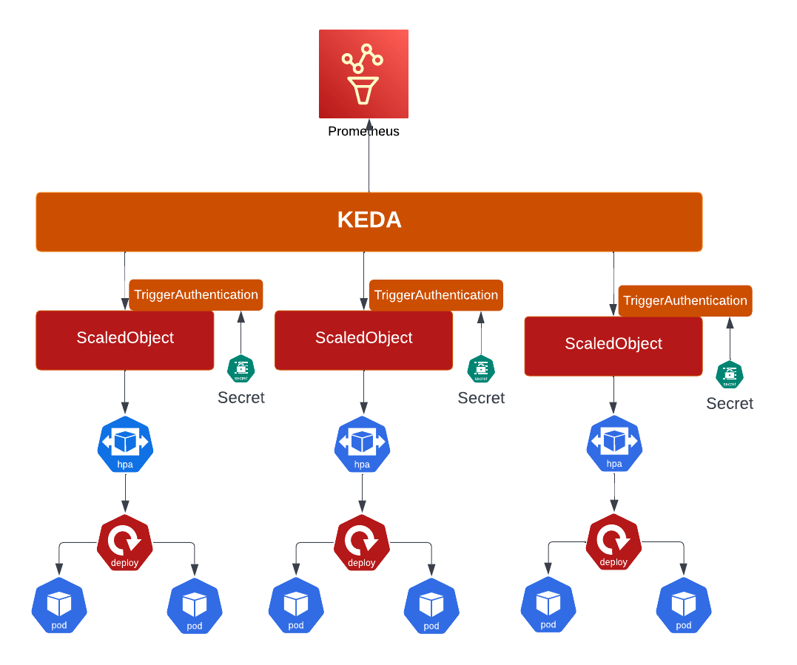

# 3 Methods of “Auto” Scaling OpenShift Applications

<br />



[Red Hat OpenShift Container Platform](https://docs.openshift.com/container-platform/4.10/welcome/index.html) (RHOCP) makes it easy for developers to deploy kubernetes-native solutions that can automatically handle apps' horizontal scaling needs, as well as many other types of management tasks, including provisioning and scaling. 

Instead of statically allocating resources, developers can leverage Helm and kubernetes resources to automate this process. This will allow app teams to respond quickly to peaks in demand, and reduce costs (compute, man hours) by automatically scaling down when resources are no longer needed. 

Pod-based horizontal scaling will be the main focus of this article. We will discuss the following:

* Scaling applications based on a schedule ([Cron](https://en.wikipedia.org/wiki/Cron)). For example scaling an app to 5 replicas at 0900; and then scaling it down to 1 pod at 2359.
* Scaling apps based on CPU/Memory utilization ([HorizontalPodAutoscaler](https://docs.openshift.com/container-platform/4.10/nodes/pods/nodes-pods-autoscaling.html)). For example scaling an app to 5 replicas when average CPU utilization is at or above 50%; and scaling it down to 1 Pod when it falls below range.
* Scaling apps based on custom metrics ([Red Hat Custom Metrics Autoscaler Operator](https://docs.openshift.com/container-platform/4.10/nodes/pods/nodes-pods-autoscaling-custom.html)). For example, scaling an AMQ consumer app to 20 replicas when pending messages in a queue are greater than 500; and scaling it down when queue size falls below 500.

<br />

# Why Use Helm?

Helm helps you manage Kubernetes applications — Helm Charts help you define, install, and upgrade even the most complex Kubernetes application. Charts are easy to create, version, share, and publish. – _Helm.sh_

To find out more about the benefits of Helm, follow [this link](https://www.cncf.io/blog/2020/08/26/why-do-devops-engineers-love-helm/).

**To get the most out of this content, foundational understandings of Kubernetes and Helm are recommended.**

_Helm charts were tested on [Red Hat OpenShift Container Platform](https://docs.openshift.com/container-platform/4.10/welcome/index.html) (RHOCP 4.10+)._

<br />

# Method #1: Scaling applications pods based on a schedule
<br />

## Overview

Schedule based scaling uses OpenShift/Kubernetes native resources called CronJob that execute a task periodically (date + time) written in [Cron](https://en.wikipedia.org/wiki/Cron) format. The [scale-up-cronjob.yaml](https://github.com/luqmanbarry/rhocp-3-ways-apps-autoscaling/blob/master/cronjob-scaler/templates/scale-up-cronjob.yaml) template handles patching the deployables to increase their pod replicas; while the [scale-down-cronjob.yaml](https://github.com/luqmanbarry/rhocp-3-ways-apps-autoscaling/blob/master/cronjob-scaler/templates/scale-down-cronjob.yaml) scales them down. Furthermore, the [values.yaml](https://github.com/luqmanbarry/rhocp-3-ways-apps-autoscaling/blob/master/cronjob-scaler/values.yaml) is where details about apps and their scaling specs are declared. Each of these two CronJobs run an **oc patch** command as _entrypoint_ command. 

The [CronJob](https://docs.openshift.com/container-platform/4.10/nodes/jobs/nodes-nodes-jobs.html#nodes-nodes-jobs-about_nodes-nodes-jobs) `schedule: "0 22 * * *"` times are based on the time zone of the [kube-controller-manager](https://kubernetes.io/docs/reference/command-line-tools-reference/kube-controller-manager/). Unless overridden by the Pod (Container Image or Pod Spec), you can find the kube-controller-manager time zone by creating a sample pod and running the **$ date** command in its terminal.


## Implementation

The helm chart creates one scale up and scale down jobs for each app deployable.

The **cronjob-scaler** helm chart github repository is available at [this](https://github.com/luqmanbarry/rhocp-3-ways-apps-autoscaling/blob/master/cronjob-scaler/README.md) location.


### Pre-Requisites

* Access to an OpenShift/Kubernetes cluster
* Required level of access on the OpenShift cluster – Sample ServiceAccount provided in the chart
* Identification of the kube-controller-manager time zone
* Workstation with oc, helm binaries installed


### Procedure


#### Identify namespace and deployables target for scheduled scaling

`DepoymentConfigs, Deployments, StatefulSets` are examples of scalable kubernetes objects.

#### Prepare the helm chart values.yaml file

Use [this site](https://crontab.guru/) to generate Cron formatted schedules. 

To identify the kube-controller-manager timezone, run `oc rsh ANY_POD_NAME> date`.


```
scaleActions:
  scaleUp:
    # Provide input in Cron Format -- Must be in kube controller TZ
    schedule: "0 3 * * *"  
    components:
    - name: app1
      resourceType: Deployment
      replicas: 2
    - name: app2
      resourceType: Deployment
      replicas: 2
    - name: app3
      resourceType: Deployment
      replicas: 2
  scaleDown:
    # Provide input in Cron Format -- Must be in kube controller TZ
    schedule: "0 5 * * *" 
    components:
    - name: app1
      resourceType: Deployment
      replicas: 1
    - name: app2
      resourceType: Deployment
      replicas: 1
    - name: app3
      resourceType: Deployment
      replicas: 1
```
<br />

#### Install cronjob-scaler Helm Chart


```
helm uninstall cronjob-scaler || true

helm upgrade --install cronjob-scaler ./cronjob-scaler \
    --set scaleActions.scaleUp.schedule="${SCALE_UP_SCHEDULE}" \
    --set scaleActions.scaleDown.schedule="${SCALE_DOWN_SCHEDULE}" \
    -f ${VALUES_FILE} \
    -n ${NAMESPACE}
sleep 30
```

<br />

### Cleanup


```
helm uninstall cronjob-scaler

sleep 15

oc delete cronjob -l app=cronjob-scaler
```

<br />

# Method #2: Scaling applications based on CPU/Memory

## Overview

As a developer, you can use a horizontal pod autoscaler (HPA) to specify how OpenShift Container Platform should automatically increase or decrease the scale of a replication controller or deployment configuration, based on metrics collected from the pods that belong to that replication controller or deployment configuration. You can create an HPA for any deployment, deployment config, replica set, replication controller, or stateful set. -- OpenShift Docs


Supported metrics The following metrics are supported by horizontal pod autoscaler (HPA):


<table>
  <tr>
   <td>Metric
   </td>
   <td>Description
   </td>
   <td>API Version
   </td>
  </tr>
  <tr>
   <td>CPU Utilization
   </td>
   <td>Number of CPU cores used. Can be used to calculate a percentage of the pod’s requested CPU.
   </td>
   <td>autoscaling/v2beta2
   </td>
  </tr>
  <tr>
   <td>Memory Utilization
   </td>
   <td>Amount of memory used. Can be used to calculate a percentage of the pod’s requested memory.
   </td>
   <td>autoscaling/v2beta2
   </td>
  </tr>
</table>


## Implementation

The **hpa-cpu-memory** helm chart uses dynamic helm template features (ie: range, if else..etc) to enable a declarative approach to creating one [HorizontalPodAutoscaler](https://github.com/luqmanbarry/rhocp-3-ways-apps-autoscaling/blob/master/hpa-cpu-memory-scaler/templates/hpa-cpu-scaler.yaml) resource per target app; one HPA object per deployable. Therefore, all deployables in a namespace in need of an HPA can be managed in a single location by just providing apps scaling specs in the  [values.yaml](https://github.com/luqmanbarry/rhocp-3-ways-apps-autoscaling/blob/master/hpa-cpu-memory-scaler/values.yaml) file.

The hpa-cpu-memory-scaler helm chart github repository is available at [this location](https://github.com/luqmanbarry/rhocp-3-ways-apps-autoscaling/tree/master/hpa-cpu-memory-scaler).


### Pre-Requisites

* Access to an OpenShift/Kubernetes cluster
* Permission to list, get, patch `HorizontalPodAutoscaler` resources. 
* Workstation with oc, helm binaries installed


### Procedure


#### Identify namespace and deployables target for HPA based scaling


`DepoymentConfigs, Deployments, StatefulSets` are examples of scalable kubernetes objects.


#### Prepare the helm chart values.yaml file

```
hpa:
  targetCPUScalePercentage: 50
  scaleDownStabilizationPeriodSeconds: 60
  scaleUpStabilizationPeriodSeconds: 60
  scaleTargets:
  - name: loadtest
    kind: Deployment
    maxReplicas: 5
    minReplicas: 1
  - name: app1
    kind: Deployment
    maxReplicas: 2
    minReplicas: 1
```
<br />

#### Deploy hpa-cpu-memory-scaler helm chart


```
helm uninstall hpa-cpu-memory-scaler || true

helm upgrade --install hpa-cpu-memory-scaler ./hpa-cpu-memory-scaler \
    -f ${VALUES_FILE} \
    -n ${NAMESPACE}

sleep 30
```
<br />

#### Watch HorizontalPodAutoscaler in Action

The **loadtest** k8s Deployment in the chart is just an example. 


```
curl http://$(oc get route/loadtest -n ${NAMESPACE} -ojsonpath={.spec.host})/api/loadtest/v1/cpu/3

watch oc get po
```
<br />

## Cleanup

```
helm uninstall hpa-cpu-memory-scaler
sleep 15
oc delete all -l app=hpa-cpu-memory-scaler
```

<br />

# Method #3: Scaling applications based on custom metrics

## 	Overview

As a developer, you can use the custom metrics autoscaler to specify how OpenShift Container Platform should automatically increase or decrease the number of pods for a deployment, stateful set, custom resource, or job based on custom metrics that are not just based on CPU or Memory.


Footnote, the custom metrics autoscaler currently (v2.7.1) supports only the Prometheus trigger, which can use the installed OpenShift Container Platform monitoring or an external Prometheus server as the metrics source.


At the time of writing this article, the Custom Metrics Autoscaler Operator is in [Technology Preview](https://docs.openshift.com/container-platform/4.10//nodes/pods/nodes-pods-autoscaling-custom.html).

<br />

## Implementation

Multiple helm charts are put together to demo this solution. 50% are for setting up the AMQ installation while the other half are for KEDA deployment and configuration. 		


<table>
  <tr>
   <td>Helm Chart
   </td>
   <td>Description
   </td>
  </tr>
  <tr>
   <td><a href="https://github.com/luqmanbarry/rhocp-3-ways-apps-autoscaling/tree/master/rhocp-keda-scaler/amq-broker-operator">amq-broker-operator</a>
   </td>
   <td>Deploys the AMQ Broker operator. It creates OperatorGroup, Subscription resources.
   </td>
  </tr>
  <tr>
   <td><a href="https://github.com/luqmanbarry/rhocp-3-ways-apps-autoscaling/tree/master/rhocp-keda-scaler/amq-broker-crs">amq-broker-crs</a>
   </td>
   <td>Deploys the AMQ broker custom resources such as the actual broker node, and a queue. 
   </td>
  </tr>
  <tr>
   <td><a href="https://github.com/luqmanbarry/rhocp-3-ways-apps-autoscaling/tree/master/rhocp-keda-scaler/amq-clients">amq-clients</a>
   </td>
   <td>When deployed, a producer for pushing messages and a consumer for pulling messages spin up; they both connect to the same queue.
   </td>
  </tr>
  <tr>
   <td><a href="https://github.com/luqmanbarry/rhocp-3-ways-apps-autoscaling/tree/master/rhocp-keda-scaler/rhocp-keda-operator">rhocp-keda-operator</a>
   </td>
   <td>Deploys the Red Hat supported version of the KEDA operator. It creates OperatorGroup, Subscription resources.
   </td>
  </tr>
  <tr>
   <td><a href="https://github.com/luqmanbarry/rhocp-3-ways-apps-autoscaling/tree/master/rhocp-keda-scaler/rhocp-keda-controller">rhocp-keda-controller</a>
   </td>
   <td>It creates a KedaController resource in the openshift-keda namespace. This resource helps with bootstrapping the operator autoscaling features.
   </td>
  </tr>
  <tr>
   <td><a href="https://github.com/luqmanbarry/rhocp-3-ways-apps-autoscaling/tree/master/rhocp-keda-scaler/rhocp-keda-crs">rhocp-keda-crs</a>
   </td>
   <td>It deploys the app namespace CRs used for declaring app autoscaling specs.
   </td>
  </tr>
</table>


The custom metric chosen for this demo is **artemis_message_count** metric which is the number of messages currently in a given AMQ queue. This includes scheduled, paged, and in-delivery messages. 


For a list of other supported Red Hat AMQ Broker metrics, follow this [link](https://access.redhat.com/documentation/en-us/red_hat_amq_broker/7.10/html-single/deploying_amq_broker_on_openshift/index#ref-br-metrics-overview_broker-ocp).


The **rhocp-keda-scaler** helm chart github repository is available at [this location](https://github.com/luqmanbarry/rhocp-3-ways-apps-autoscaling/tree/master/rhocp-keda-scaler).

<br />

### Pre-Requisites

* Access to an OpenShift/Kubernetes cluster
* User need following permissions: _edit, cluster-monitoring-edit, cluster-monitoring-view_ 
* Permission to _list, get, patch_ Subscriptions, OperatorGroups, InstallPlans resources
* Workstation with oc, helm binaries installed


### Procedure

Take a look at each individual script in the [shell-scripts/](https://github.com/luqmanbarry/rhocp-3-ways-apps-autoscaling/tree/master/rhocp-keda-scaler/shell-scripts) directory to understand where and how each component is deployed. [rhocp-keda-scaler/](https://github.com/luqmanbarry/rhocp-3-ways-apps-autoscaling/tree/master/rhocp-keda-scaler) will be used as the root directory throughout the steps that follow.

To deploy the entire solution with one command, run sh shell-scripts/install.sh. Likewise to cleanup all deployed resources, run sh shell-scripts/cleanup.sh.


#### Install AMQ Broker Operator, Custom Resources

<br />

```
sh ./shell-scripts/install-amq.sh
```
<br />

#### Deploy AMQ Clients -- Producer, Consumer


```
sh shell-scripts/install-amq-clients.sh
```
<br />

#### Install Red Hat OpenShift Custom Metrics Operator


```
sh shell-scripts/install-keda-operator.sh
```
<br />

#### Deploy operator custom resources for apps autoscaling

These resources are deployed in the same namespace as our target apps. 

```
sh shell-scripts/install-keda-crs.sh
```
<br />

## Cleanup

To cleanup everything in one sweep, run sh shell-scripts/cleanup.sh. Otherwise execute the scripts in this order.


```
sh shell-scripts/cleanup-keda-crs.sh

sh shell-scripts/cleanup-keda-operator.sh

sh shell-scripts/cleanup-amq-clients.sh

sh shell-scripts/cleanup-amq.sh
```
<br />

# Summary

In this article we’ve learned 3 different methods of natively automating horizontal pod autoscaling. The cronjob-scaler chart demonstrates how to scale apps using date & time, hpa-cpu-memory-scaler chart shows how to scale apps based on Pods CPU & Memory utilization; while the third option takes this a step further by scaling pods based on a Prometheus query results. We’ve also learned basic concepts of helm such as control flow loops (if else, range, when), helm variables, usage of builtin objects, named templates and template functions. 

<br />

# Sources

## 	Products Docs and Articles

* [https://docs.openshift.com/container-platform/4.10/welcome/index.html](https://docs.openshift.com/container-platform/4.10/welcome/index.html)
* [https://en.wikipedia.org/wiki/Cron](https://en.wikipedia.org/wiki/Cron)
* [https://docs.openshift.com/container-platform/4.10/nodes/pods/nodes-pods-autoscaling.html](https://docs.openshift.com/container-platform/4.10/nodes/pods/nodes-pods-autoscaling.html)
* [https://docs.openshift.com/container-platform/4.10/nodes/pods/nodes-pods-autoscaling-custom.html](https://docs.openshift.com/container-platform/4.10/nodes/pods/nodes-pods-autoscaling-custom.html)
* [https://docs.openshift.com/container-platform/4.10/nodes/jobs/nodes-nodes-jobs.html#nodes-nodes-jobs-about_nodes-nodes-jobs](https://docs.openshift.com/container-platform/4.10/nodes/jobs/nodes-nodes-jobs.html#nodes-nodes-jobs-about_nodes-nodes-jobs)
* [https://kubernetes.io/docs/reference/command-line-tools-reference/kube-controller-manager/](https://kubernetes.io/docs/reference/command-line-tools-reference/kube-controller-manager/)
* [https://crontab.guru/](https://crontab.guru/)


## 	Apps Scaler Repositories

* cronjob-scaler: [https://github.com/luqmanbarry/rhocp-3-ways-apps-autoscaling/tree/master/cronjob-scaler](https://github.com/luqmanbarry/rhocp-3-ways-apps-autoscaling/tree/master/cronjob-scaler)
* hpa-cpu-memory-scaler: [https://github.com/luqmanbarry/rhocp-3-ways-apps-autoscaling/tree/master/hpa-cpu-memory-scaler](https://github.com/luqmanbarry/rhocp-3-ways-apps-autoscaling/tree/master/hpa-cpu-memory-scaler)
* rhocp-keda-scaler: [https://github.com/luqmanbarry/rhocp-3-ways-apps-autoscaling/tree/master/rhocp-keda-scaler](https://github.com/luqmanbarry/rhocp-3-ways-apps-autoscaling/tree/master/rhocp-keda-scaler)